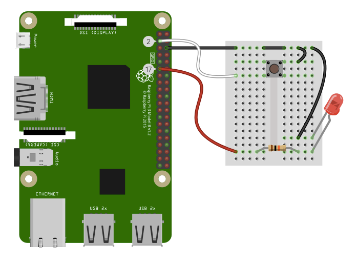

# Pi? Pi! Pie?! Day Workshop

Description from the [Meetup](https://www.meetup.com/San-Diego-Code-Kitchen/events/248713417/):

> Ain't no lie, baby, Pi Pi Pi day is here. We'll be celebrating with some fun Raspberry Pi* (and Actual Pie 🥧) activities. Whether you like learning electronics with tiny credit-card-sized computers OR eating delicious pie, mark your calendars for this special event. If you have your own Raspberry Pi, go ahead and bring it! Please bring a laptop, too, if you have one. We'll be bringing microSD cards pre-loaded with PiBakery images, and we'll have 5-6 Raspberry Pi computers on hand, plus jumper wires and breadboards, so attendees can  
> • work together in groups to set up a Pi,  
> • hook it to a breadboard with a physical button, and  
> • make some Fun Things happen. 🔊🚨📡  

Yes, there was delicious pie.
✨🥧:sparkles:	

## Hello, Raspberry Pi.

If you are here, you *probably* already know what a [Raspberry Pi](https://www.raspberrypi.org/) is! 

To reiterate: Raspberry Pi is a small credit-card-sized (or smaller) computer, that costs no more than $35. Like most other computers, you can hook up a keyboard, mouse, and monitor to it. *Unlike* most computers, it has a set of GPIO pins ("General Purpose Input/Output"), similar to a microcontroller like an Arduino. These pins let you connect it to electronic sensors and lights and motors, and *THAT IS WHERE THE FUN HAPPENS.* The latest Pi models also have onboard WiFi and Bluetooth, meaning that there's a lot you can do with such a tiny circuitboard. 

Today, we've brought a bunch of breadboards and electronic components for you to connect to your Pi. We'll be setting up our Raspberry Pi computers to run "headless" (without a monitor), and log into them from our laptops. We'll use the Python scripting language to program them to light up an LED, react to a physical button press, play sounds on these tiny greeting-card speakers, and more. (And we'll also eat pie. Because PIE.)

## Setting up the Pi

A Raspberry Pi uses a microSD card for onboard storage—like a hard disk, but one that you can swap out. Since it's a tiny computer, it has an operating system (OS), and we're using the default [Raspbian](https://www.raspbian.org/), which is a flavor of the Linux distribution [Debian](https://www.debian.org/) that's optimized for the Pi. 

The latest versions of Raspbian OS require just over 4GB, so we've brought a bunch of [8GB class 10 microSD cards](https://www.amazon.com/SanDisk-Ultra-Memory-Adapter-SDSDQUAN-008G-G4A/dp/B00QLT29CQ/ref=sr_1_3?ie=UTF8&qid=1522648378&sr=8-3&keywords=sandisk+micro+sd+card+8gb+class+10). You don't need much more storage, but it's harder to find cards with only 8GB on them; we recommend class 10 because they read/write much faster and perform better than the typical class 4 cards.

A few years back, installing the OS was a painful process that would take hours and hours; now, thankfully, there's a great free tool called [PiBakery](http://pibakery.org/), which installs the Raspbian OS, and then follows a recipe of instructions on "first boot," "next boot," or "every boot."

Here's the recipe we used to set up the Pi computers for this workshop:


Download the recipe: [pi-pi-pi-recipe.xml](./pi-pi-pi-recipe.xml)

This recipe...

* sets the hostname
* changes the password
* enables the [VNC server]()
* sets up autoloading of [SPI and I2C]()
* sets up the wifi
* installs a bunch of packages, whether individually, or [from install scripts like Adafruit's](https://apt.adafruit.com/install), including
  * `node` , a runtime/webserver that lets you program the Pi with JavaScript *(comes in handy for other projects)*
  * `mpg321`, an application to play MP3s
  * `fbi`, an application to show full-screen images from the command line *(comes in handy for other projects)*
  * `samba`, a way to let Windows and MacOS computers share files with the Pi
  * `avahi`, a service for Bonjour / zeroconf, which is a way to let other computers see the Pi by a local name (like `applepi.local`) without needing to know it's IP address numbers (like `10.0.1.18`).
  * `netatalk` , or AppleTalk drivers, which let a Mac see the Pi as a shared drive in the Finder
* creates a `Projects` folder in the home directory for user `pi`, which we'll use to hold our creative projects' code and assets

PiBakery will run these installation scripts on first boot, and it could take around 20 minutes. When it's done, it will shut down. If the red light is steady and the green light is not flickering (and has not lit up for a full count of 60 seconds), it's off and you can disconnect it from power. 

**Like any computer, you don't want to disconnect a Pi from power without properly shutting it down.** You may luck out, but in our experience, doing this can sometimes corrupt the SD card, and you may need to reformat it. We'll talk about proper shutdown [when we talk about remote controlling your Pi with SSH later in this workshop](#shutdown).

:warning: **Side note:** We're using the [Adafruit setup scripts](http://apt.adafruit.com/install/) as a part of this recipe, as noted above, to set up filesharing with Samba and AppleTalk…and the Adafruit scripts don't work with the latest version of Raspbian (Stretch), so unless you want to do that setup manually, [you'll have to roll PiBakery back to the previous version of Raspbian (Jesse)](https://github.com/davidferguson/pibakery/issues/112#issuecomment-367054193). You will only need the full version of Raspbian, not Lite, unless you're installing on an older Pi or a Pi Zero model.  
<small>*(Yes, Raspbian/Debian versions are [named after Toy Story characters](https://www.debian.org/doc/manuals/debian-faq/ch-ftparchives#s-sourceforcodenames).)*</small>  

## Setting up the electronic components

You should have a ziploc bag with the following components:

* 1 x plastic speaker
* 1 x screw-terminal TRRS headphone jack
* 1 x red LED
* 1 x 10KΩ resistor
* 1 x mini-breadboard
* 3 black wires of different lengths (22AWG)
* 3 male-to-female jumper cables (red, white, black)

### Let's make a speaker

We bought a bunch of these [$1.75 plastic speakers](https://www.adafruit.com/product/1891) and [$2.50 screw-terminal TRRS headphone jacks](https://www.adafruit.com/product/2914) on Adafruit. 

TRRS means tip, ring, ring, sleeve—which just means that the headphone jack has three bands on it, splitting it into four sections. One is for the left audio, one is for the right audio, and the other two are for the microphone (or composite video) and a common ground. 

⚠️ [There are different TRRS standards!](https://en.wikipedia.org/wiki/Phone_connector_(audio)#TRRS_standards) Raspberry Pi does *not* wire up as labeled on the headphone jack plug from Adafruit.


You're going to want to connect the **positive wire** from the speaker **to** the `L`(**left**) terminal, and the **negative wire to ground**—which for the Pi is not the terminal with the ground symbol, but the unmarked third terminal. 

ℹ️ **Side note:** We were too strapped for time to make amplifier circuits for this workshop, but you can *physically* amplify the speaker by making a cardstock cone around it. Even an old toilet-paper tube makes it louder!

### Working with a breadboard

A breadboard is used for prototyping circuits, and it has a grid of holes into which you can stick wires. 

In the tiny mini-breadboards we're using, all of the holes in a row (on each side) are connected, but the two sides are not connected.


We're going to plug in a button, a resistor, and an LED, and then we're going to plug in the circuit to the GPIO pins on the Pi. Here's a schematic of what it will look like:  


…and here's a [Fritzing](https://fritzing.org) drawing.


_Fritzing source file: [pi-pi-pi-day.fzz](./pi-pi-pi-day.fzz)_

The LED has a short leg and a long leg; the short leg goes to ground, like it's leaning back. Also, note that the pushbutton is a switch that connects diagonal corners.

Don't connect the jumper cables to the Pi *quite* yet, because we first need to explain something important about the GPIO pins.

### Connecting to the GPIO pins

Here's the one part where it gets a bit confusing: pin numbers.

The *physical* pins have numbers just so you know which one we're talking about. They're numbered by row and column.

However the addresses for these pins—the numbers by which your code and your fellow Pi hackers refer to them—are different from the physical pin numbers. So if someone tells you to connect to GPIO pin 2 (or Broadcom pin 2, or BCM 2) …that's actually *physical pin 3.*  


_(This gets even MORE confusing if you're using a library called "WiringPi," which gives the pins a third number address, but we're not going to go there today.)_

Some of the pins have double purposes: besides being _general purpose_, they have a special purpose as well. This is where **pinout guides** are handy.

 <https://pinout.xyz>

Some pins (as you see above) are ground, some are power. Some are digital only, some are `PWM`-capable (pulse width modulation). You'll see that BCM 2 (physical pin 3) is marked as an `I2C` pin. (`I2C` and `SPI` are ways that you can talk to fancy sensors with fewer pins …so that you don't have to use up most of your pins.)

⚠️ **A general warning:** In general, don't connect things to your Pi when it is powered on—*as a rule of thumb*—unless you are very *very* careful. The risk is low, and your circuits will often be forgiving, but you don't want to accidentally short two pins together, or hook an electronic component to a higher voltage. 

Connect the circuit as shown:



## Telling the Pi what to do

We're not hooking a screen or keyboard or mouse to the Pi so how do we tell it what to do? 

* **SSH** (Secure SHell) lets us issue text commands to it.
* **Filesharing** lets us move files to it and edit files on it.
* Alternately, screensharing (or **VNC**, [Virtual Network Computing](https://en.wikipedia.org/wiki/Virtual_Network_Computing)) lets us remotely connect to a graphical user interface.

### SSH

You can use SSH by using the built-in Terminal app on MacOS (`/Applications/Utilities/Terminal.app`) or PuTTY on Windows (<https://www.chiark.greenend.org.uk/~sgtatham/putty/latest.html>).

Terminal and PuTTY are **command line interfaces**. We type a command to use ssh to connect to (and log into) the Pi, and then use commands to control the Pi.

If we named our Pi computer `applepi`, then to connect to it, you'd type:
 `ssh pi@applepi.local`

For a tutorial on how to navigate the Pi and we recommend [this free PDF zine on how to use the command line](https://hellowebbooks.com/learn-command-line/).

That said, here are some commands you may find handy:

- `pwd` = get the path of the working directory *(where am I?)*
- `cd` = change directory 
- `ls -al` = list all of the files in the current directory
- `touch something.txt` = create an empty text file called something.txt in the current directory
- `raspi-config` = open a program to change system settings for the Raspberry Pi.
- `sudo` = do as a *superuser*—while logged in as the user `pi`, you're restricted to certain things, unless you ask for permission. `sudo` will ask for your (`pi`'s) password to run the command.
- <a name="shutdown"></a>`sudo shutdown -h now` = **shut down the Pi *now***, halting all running programs

### Filesharing 

If everything was set up correctly by PiBakery, you should be able to see the Pi in the MacOS Finder (under **SHARED** in the sidebar, or by `Go > Connect to Server (⌘+K)` and typing `smb://applepi.local`) or in the Windows Explorer (under **Network**, or by typing `smb://applepi.local` in the address bar).

You'll need to log in as a registered user with the credentials you set earlier in PiBakery:  user `pi` and password _(whatever you set in PiBakery)_.

You should see the home directory, and a Projects folder inside that (which our PiBakery recipe created). 

ℹ️ Let's put all of our files for this workshop inside a folder called `~/Projects/doorbell`. You can make this folder now, via SSH (with `mkdir ~/Projects/doorbell` ) or via filesharing.

One of the great things about filesharing is that you can now use a text editor (or IDE) on your laptop to edit and save code *on the Pi itself*.

### VNC (Screensharing)

The newer versions of Raspbian have a VNC server (RealVNC Connect) pre-installed. To screenshare with them, you'll need to download and install the free [RealVNC Viewer](https://www.realvnc.com/en/connect/download/viewer/) on your computer.

⚠️ You'll want to make the default screen size bigger. Since we're not exploring VNC in this workshop, this is left as an exercise to the reader. You may want to [read this](https://support.realvnc.com/Knowledgebase/Article/View/393/5/how-can-i-change-the-geometry-of-a-vnc-server-in-virtual-mode-desktop) and [also this](https://superuser.com/questions/184338/how-to-change-screen-resolution-of-vnc-server-without-restarting-it#218740).

## Programming with Python

We're using the Python programming language (which is where the Pi gets its name). If you're already familiar with programming languages like JavaScript, Python is a bit different: it has no semicolons (`;`), but whitespace—particularly indentation—*does* matter.

We're also taking advantage of a GPIO library in Python called `gpiozero` which is very well-documented with circuit diagrams and sample code for many basic circuits. 
<https://gpiozero.readthedocs.io/en/stable/recipes.html>

### Blinky LED

Lighting up an LED is the "hello world" of physical computing!

Create a file in the `~/Projects/doorbell` folder called `blinky_led.py` and type the following inside.

```python
from gpiozero import LED
from time import sleep

red = LED(17)

while True:
    red.on()
    sleep(1)
    red.off()
    sleep(1)
```

Run it via SSH by typing `python blinky_led.py` while inside the `doorbell` folder where this python file is found.

⚠️ Did you get errors? Is your code correct? You **may need to run the Python file as superuser** to get the GPIO to work:
`sudo python blinky_led.py`

ℹ️ To stop the python program, use the key combination `Ctrl`+`C`.

### Simple button

Let's create `simple_button.py` and test out the button. This program should write text to the screen when the button is pressed.

```python 
from gpiozero import Button
from signal import pause

def say_hello():
    print("Hello!")

button = Button(2)
button.when_pressed = say_hello

pause()
```

### Simple button 2

Create`simple_button2.py`. Now we're going to use functions (which begin with `def` to **def**ine the function), and light up the LED while the button is pressed.

```python
from gpiozero import Button,LED
from signal import pause

red = LED(17)
button = Button(2)

def say_hello():
    print("Hello!")
    red.on()

def say_goodbye():
    red.off()

button.when_pressed = say_hello
button.when_released = say_goodbye

pause()
```

Can you get it to print a goodbye message when the button is released?

## Putting it together to make a doorbell

### Play a sound

Copy a doorbell sound over to your Pi, to the `doorbell` folder, using filesharing. If you don't have an MP3 handy to use, or don't want to record your own, we recommend looking for free doorbell sounds on...

- [freesound.org](https://freesound.org/search/?q=doorbell)
- [internet archive](https://archive.org/details/audio)

Here's an [example sound](https://archive.org/details/NormCopelandOurDoorbell).

Connect to the Pi via SSH, if you haven't already. 
Make sure the volume is turned up all the way by running `alsamixer` and using the up and down arrows to change the volume (and `Esc` to quit).

Plug in the speaker you wired up. Did you make an amplifying cone for it? Use that.

Now play a sound (such as `doorbellA.mp3`), like so: `mpg321 doorbellA.mp3`  Do you hear anything??

### Play a sound when a button is pressed

Create the python script file `doorbell.py`, which will build on your previous scripts.

```python
from gpiozero import Button,LED
from signal import pause
from subprocess import call
import sys

red = LED(17)
button = Button(2)

def say_hello():
    print("Hello!")
    call(['mpg321','doorbellA.mp3'])
    red.on()

def say_goodbye():
    red.off()

button.when_pressed = say_hello
button.when_released = say_goodbye

pause()
```

`call` from the `subprocess` library will run a command line app and then waits for it to finish before it continues with the next line of code. 

ℹ️ Does your LED turn on for the duration of audio file? If not, how would you rewrite the code above to make it do that?

## What's next?

### Set it up to start on boot

PiBakery is your friend here for the easiest way to set up a program to run on boot. 

When everything is all working in your code, shut down the Pi, eject the microSD card, put it into your computer with Pi Bakery already running, and modify the recipe. 

Under the `On Every Boot` block, put a block to run the python script `doorbell.py`.

### BONUS: Control it with your phone

ℹ️ *We didn't get to this activity in the workshop, but if you want to have further fun with the same circuit and some new code, have at it!*

You can run a web server from a Raspberry Pi, and that server can interact with the GPIO pins on the Pi, so we can use a web page to control physical things. One of the fastest ways to do this is with websockets!

We'll build upon [this tutorial to light up an LED with websockets](https://github.com/patrickfuller/pi-websocket) using a Python webserver called Tornado.

`sudo apt-get install python-tornado`

We've adapted the code to use `gpiozero`, and the two files we'll be changing are `methods.py`:

```python
from gpiozero import Button,LED
from subprocess import call

red = LED(17)
button = Button(2)

# def toggle_led(isOn):
#     if(isOn):
#         red.on()
#     else:
#         red.off()

def toggle_led(isOn):
    if(isOn):
        red.on()
        call(['mpg321','../doorbellA.mp3'])
        red.off()
```

and `client.js`:

```javascript
/*global WebSocket, $, window, console, alert, Blob, saveAs*/
"use strict";

/**
 * Function calls across the background TCP socket. Uses JSON RPC + a queue.
 */
var client = {
    queue: {},
    led_on: false,

    // Connects to Python through the websocket
    connect: function (port) {
        var self = this;
        this.socket = new WebSocket("ws://" + window.location.hostname + ":" + port + "/websocket");

        this.socket.onopen = function () {
            console.log("Connected!");
        };

        this.socket.onmessage = function (messageEvent) {
            var router, current, updated, jsonRpc;

            jsonRpc = JSON.parse(messageEvent.data);
            router = self.queue[jsonRpc.id];
            delete self.queue[jsonRpc.id];
            self.result = jsonRpc.result;

            // Alert on error
            if (jsonRpc.error) {
                alert(jsonRpc.result);

            // If the server returns, change the LED message. Note that this
            // is unnecessary complexity, but I want to show off how to extend
            // server response handling.
            } else if (router === "toggle_led") {
                $(".answer").html("LED is currently " + (self.led_on ?
                                  "on" : "off") + ".");

            // No other functions should exist
            } else {
                alert("Unsupported function: " + router);
            }
        };
    },

    // Generates a unique identifier for request ids
    // Code from http://stackoverflow.com/questions/105034/
    // how-to-create-a-guid-uuid-in-javascript/2117523#2117523
    uuid: function () {
        return 'xxxxxxxx-xxxx-4xxx-yxxx-xxxxxxxxxxxx'.replace(/[xy]/g, function (c) {
            var r = Math.random()*16|0, v = c == 'x' ? r : (r&0x3|0x8);
            return v.toString(16);
        });
    },

    // Sends a message to toggle the LED
    toggle_led: function () {
        this.led_on = !this.led_on;
        var uuid = this.uuid();
        this.socket.send(JSON.stringify({method: "toggle_led", id: uuid, params: {isOn: this.led_on}}));
        this.queue[uuid] = "toggle_led";
    }

};
```

and don't forget to change the `index.html`, line 11:

```html
<button class="submit" onclick="javascript:client.toggle_led()">Toggle LED</button>
```


### Thank you for attending!

Big thanks to [Sandbox](https://sandboxvenue.com) for hosting us!

_*Workshop* conducted by [@surfincolin](https://github.com/surfincolin) & [@jasonalderman](https://github.com/jasonalderman) on 3/14/2018._
